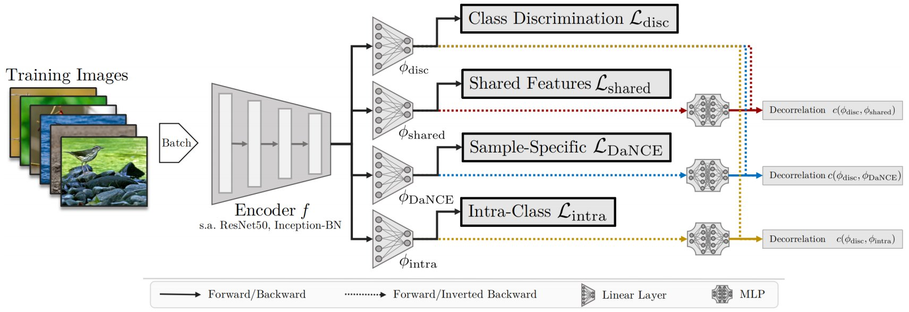
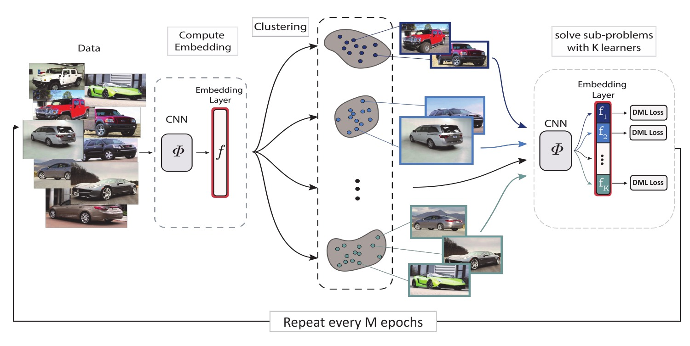
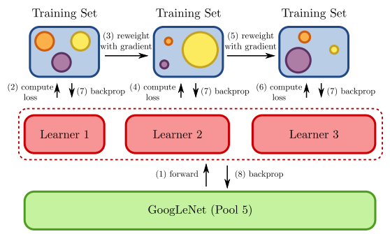
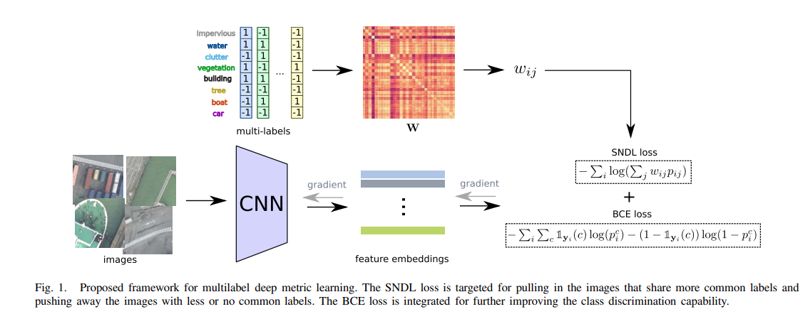

# CV4RS
A Comparative Analysis of Multi-Task Learning Approaches in the Context of Multi-Label Remote Sensing Image Retrieval

# Datasets
1. [BigEarthNet](http://bigearth.net) 
2. [MLRSNet](https://github.com/cugbrs/MLRSNet)  

# Reference papers:
1. DiVA : Diverse Visual Feature Aggregation for Deep Metric Learning [git](https://github.com/Confusezius/ECCV2020_DiVA_MultiFeature_DML)  [pdf](https://arxiv.org/abs/2004.13458)

2. Divide and Conquer the Embedding Space for Metric Learning [git](https://github.com/CompVis/metric-learning-divide-and-conquer)  [pdf](http://openaccess.thecvf.com/content_CVPR_2019/papers/Sanakoyeu_Divide_and_Conquer_the_Embedding_Space_for_Metric_Learning_CVPR_2019_paper.pdf)

3. Deep Metric Learning with BIER: Boosting Independent Embeddings Robustly [git](https://github.com/mop/bier)  [pdf](https://arxiv.org/abs/1801.04815)

4. Improving Generalization via Scalable Neighborhood Component Analysis [git](https://github.com/microsoft/snca.pytorch)  [pdf](https://openaccess.thecvf.com/content_ECCV_2018/papers/Zhirong_Wu_Improving_Embedding_Generalization_ECCV_2018_paper.pdf) 
Graph Relation Network: Modeling Relations Between Scenes for Multilabel Remote-Sensing Image Classification and Retrieval [pdf](https://www.umbc.edu/rssipl/people/aplaza/Papers/Journals/2020.TGRS.GRN.pdf)
